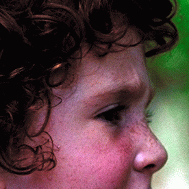
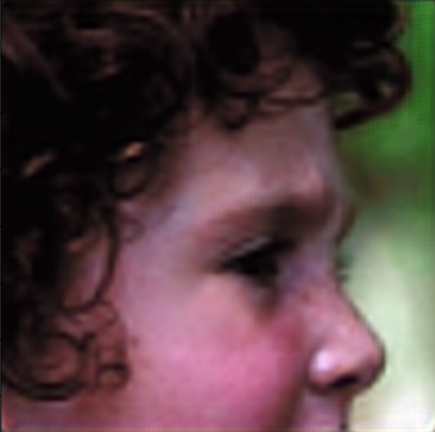
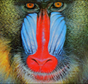

# Single Image Super-Resolution Using a Generative Adversarial Network
In this project I implement the paper [Generative Adversarial Nets](https://arxiv.org/pdf/1406.2661.pdf) that introduces the SRGAN model for single image super resolution task.

## References
[Generative Adversarial Nets](https://arxiv.org/pdf/1406.2661.pdf)\
[Photo-Realistic Single Image Super-Resolution Using a Generative Adversarial Network](https://arxiv.org/pdf/1609.04802.pdf)

## Configuration
Create a python environment:
```
python3 -m venv <env-name>
```

Activate the environment:
```
source <env-name>/bin/activate
```

Install the depencies:
```
pip install -r requirements.txt
```

## Training
In order train the SRGAN model, exectue to following CLI command:
```
python3 train.py <config-file>
```
Where `<config-file>` is the path to the training configuration file. It is basically a YAML file containing the information needed for the training. See [example.yml](./config/example.yml) for example. \
The model is trained by default to generate 4x super resolutions of 96 $\times$ 96 images. So the input images are resized to 6 $\times$ 96.

## Super Resolution
In order to generate the super resolution of an input image, execute the following CLI command:
```
python3 super-resolution.py <weight-path> <image>
```
Where `<weight-path>` is the path to the pretrained weights of the model. And `<image>`is the path to the input image.\

Here is some examples of super resolution results:
<div style="display: flex">
    <div style="display:flex; flex-direction:column; align-items:center">
        <span>Low resolution</span>
        
    </div>
    <div style="display:flex; flex-direction:column; align-items:center">
        <span>High resolution</span>
        
    </div>
    <div style="display:flex; flex-direction:column; align-items:center">
        <span>Super resolution</span>
        
    </div>
</div>
<div style="display: flex">
    <div style="display:flex; flex-direction:column; align-items:center">
        <span>Low resolution</span>
        
    </div>
    <div style="display:flex; flex-direction:column; align-items:center">
        <span>High resolution</span>
        
    </div>
    <div style="display:flex; flex-direction:column; align-items:center">
        <span>Super resolution</span>
        
    </div>
</div>
<div style="display: flex">
    <div style="display:flex; flex-direction:column; align-items:center">
        <span>Low resolution</span>
        
    </div>
    <div style="display:flex; flex-direction:column; align-items:center">
        <span>High resolution</span>
        
    </div>
    <div style="display:flex; flex-direction:column; align-items:center">
        <span>Super resolution</span>
        
    </div>
</div>
<div style="display: flex">
    <div style="display:flex; flex-direction:column; align-items:center">
        <span>Low resolution</span>
        
    </div>
    <div style="display:flex; flex-direction:column; align-items:center">
        <span>High resolution</span>
        
    </div>
    <div style="display:flex; flex-direction:column; align-items:center">
        <span>Super resolution</span>
        
    </div>
</div>
<br/>

It can be noticed that the super resolutions given by the trained model on Set14 dataset are not very good. Which is expected as explain in the [original paper](https://arxiv.org/pdf/1609.04802.pdf). For simplicity, the model was trained using the MSE loss as the content loss. And the MSE loss tends to give the average of all the best super resolutions for the input image. Which gives a smooth texture that gives this blurry effect.